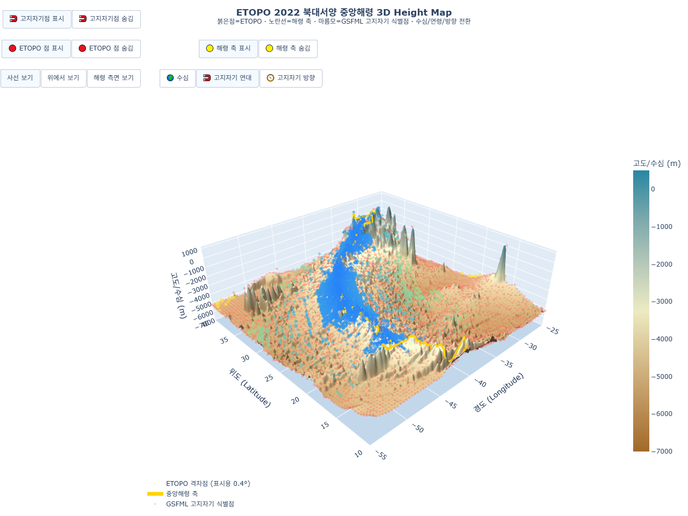
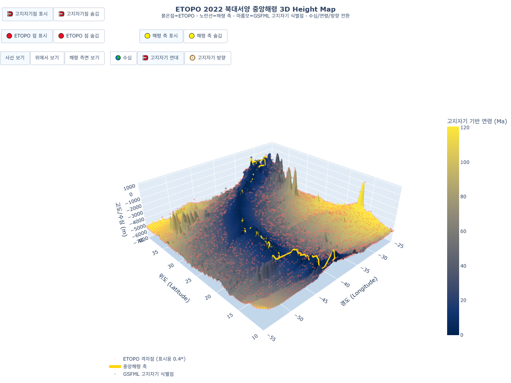
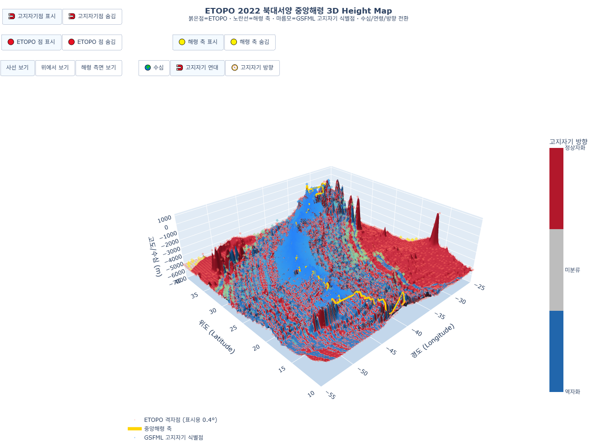

> **최신 지도:** 12번 HTML은 EMAG2v3 해수면 자기 이상 격자를 지형 표면에 표시합니다. [최신 자료 설명](data/emag2v3/README.md)을 참조하세요. 아래는 과거 분석 기록입니다.

# 실제 자료 기반 북대서양 중앙해령 3D 분석 보고서

## 1. 연구 목적

이 연구의 목적은 실제 해저 지형과 고지자기 자료를 하나의 3차원 지도에 결합하여 북대서양 중앙해령의 지형, 해양지각 연령, 자기극성 방향의 공간적 관계를 확인하는 것이다.

초기 분석처럼 26°N 단면 하나만 선택하면 특정 지점의 세부 구조는 볼 수 있지만, 위도에 따라 굽고 변환단층에 의해 어긋나는 중앙해령 전체의 형태를 설명하기 어렵다. 따라서 최종 분석은 단일 위도에 고정하지 않고 **10–40°N, 55–25°W**의 광역 범위를 사용한다.

최종 결과물은 [`output/12_ridge_focused_3d_heightmap.html`](output/12_ridge_focused_3d_heightmap.html)이며, 같은 ETOPO 2022 지형면을 다음 세 가지 방식으로 전환하여 관찰할 수 있다.

1. **수심**: 해저 지형의 높낮이
2. **고지자기 연대**: 고지자기 식별 자료로 제약된 해양지각 연령
3. **고지자기 방향**: 연령과 지자기 극성 연대표를 결합해 분류한 정상·역자화 방향

지각열류량 자료와 26°N 고정 단면은 최종 12번 3D 지도에서 제외하였다.

## 2. 연구 자료

| 자료 | 분석 범위 및 개수 | 최종 지도에서의 역할 |
|---|---:|---|
| NOAA NCEI ETOPO 2022 v1 15 arc-second `bed_elev` | 원본 추출 범위 10–40°N, 60–20°W, 0.1° 간격 120,701점 | 3D 표면의 실제 고도·수심 |
| EarthByte Seton et al. (2020), Gee–Kent 2007 연령 격자 | 10–40°N, 55–25°W, 0.1° 간격 90,601점 | 해양지각 연대 표면색 |
| GSFML Atlantic Preferred Magnetic Picks | 같은 범위 11,925점 | 출판된 magnetic chron 식별 위치와 연대 표시 |
| CK95 지자기 극성 연대표 | 정상·역자화 구간 185개 | 연령 격자를 정상자화·역자화·미분류로 변환 |

### 2.1 ETOPO 2022 해저 지형

ETOPO 2022는 음향측심 자료, 위성 고도계 기반 중력 반전 자료 등 여러 관측 자료를 통합한 전 지구 수치표고모델이다. 따라서 이 보고서에서 사용하는 격자는 개별 지점마다 새로 음향 왕복시간을 측정한 원시 측선 자료가 아니라, 실제 관측에 기반해 편집된 합성 지형 모델이다.

자료는 NOAA ArcGIS ImageServer의 `exportImage` 방식으로 ETOPO 2022 `bed_elev` 래스터를 지정하여 내려받았다. 원자료의 15 arc-second 제품을 분석용 **0.1° 규칙 격자**로 추출하였다. 전체 자료의 고도 범위는 약 **-6,706.17–1,100.67 m**이며, 최종 뷰어는 이 가운데 55–25°W 부분을 사용한다.

### 2.2 고지자기 기반 해양지각 연령

연령 표면은 EarthByte의 Seton et al. (2020) 해저 연령 모델 가운데 Gee–Kent 2007 연대표를 적용한 6 arc-minute 격자를 0.1° 간격으로 추출한 것이다. 지역 내 원자료 연령 범위는 약 **0.01–155.31 Ma**이다.

이 값은 각 격자에서 직접 암석 시료의 연대를 측정한 결과가 아니다. 선박 자력 탐사에서 식별한 magnetic chron, 해저확장 등연령선, 판구조 복원 결과를 결합해 만든 연속 연령 모델이다. 따라서 ‘고지자기 연대’ 탭은 고지자기 관측으로 제약된 **해양지각 생성 연령**을 뜻한다.

### 2.3 GSFML 고지자기 식별점

마름모 표시는 GSFML 자료에서 추출한 대서양 preferred magnetic picks 11,925점이다. 각 점에는 경도, 위도, chron 이름, chron 경계의 시작·끝 구분, Gee–Kent 2007 연대, 식별 품질, 참고문헌, 식별 방법이 포함된다.

이 점들은 연속 표면과 독립적인 별도 관측·해석 위치이므로 해저면보다 240 m 위에 배치하였다. 마름모의 색은 어느 탭에서도 **해당 식별점의 연대**를 나타내며, ‘고지자기 방향’ 탭에서도 마름모 자체가 정상·역자화를 뜻하는 것은 아니다.

### 2.4 고지자기 방향

방향 표면은 CK95 지자기 극성 연대표를 EarthByte 연령 격자에 적용해 계산하였다.

- **빨강(+1)**: 정상자화 — 형성 당시 지구 자기장 방향이 현재와 같은 구간
- **파랑(-1)**: 역자화 — 형성 당시 지구 자기장 방향이 현재와 반대인 구간
- **회색(0)**: 연대표 적용 범위를 벗어난 미분류 구간

따라서 이 층은 자기장 세기나 nT 단위의 자기 이상 지도가 아니다. 연령으로부터 판정한 **자기극성 방향의 범주형 지도**이다.

## 3. 분석 및 시각화 방법

### 3.1 중앙해령 축 추정

중앙해령은 위도에 따라 크게 굽기 때문에 전체 영역에서 단순히 가장 얕은 점을 선택하면 섬이나 해산을 해령으로 잘못 판단할 수 있다. 이를 줄이기 위해 10–40°N 사이에 중앙해령의 대략적인 기준 경도를 설정하고, 각 위도에서 그 경도의 **±5° 회랑** 안에 있는 ETOPO 최천부를 해령 축 후보로 선택하였다. 이후 위도 방향 7개 지점 중앙값 필터를 적용해 한 지점만 급격히 튀는 축 위치를 완화하였다.

추정 축은 3D 지도에서 노란 선으로 표시된다. 이 선은 판 경계의 공식 벡터 자료가 아니라 ETOPO 지형으로 계산한 근사 축이므로, 세부 변환단층 위치를 정밀하게 판정하는 용도로 사용해서는 안 된다.

### 3.2 3D 지형면 보정

ETOPO 원자료의 급격한 한 칸 변화와 삼각형 모양의 렌더링 잡음을 줄이기 위해 표시용 지형면에만 다음 처리를 적용하였다.

1. 각 격자값을 주변 3×3 중앙값과 비교한다.
2. 주변 중앙값과 **800 m 이상** 차이 나는 단일 격자값만 주변 중앙값으로 교체한다.
3. 결과에 표준편차 **σ=0.85 격자**의 Gaussian 필터를 적용한다.

이 처리는 시각적 보간면에만 적용된다. 원 ETOPO 값은 바꾸지 않았으며, 지도에서 붉은 점으로 켜고 끌 수 있다. 화면 혼잡을 줄이기 위해 원자료 0.1° 격자 중 4칸마다 하나씩, 즉 **0.4° 간격 5,776점**을 표시한다.

평활화는 한 칸짜리 바늘 모양 아티팩트를 억제하기 위한 것이지 실제 해령·해산·섬을 모두 평탄화하기 위한 것이 아니다. 따라서 여러 격자에 걸쳐 나타나는 큰 봉우리와 실제 급경사는 남아 있다.

### 3.3 세 가지 표면색

세 버튼은 표면의 높이를 바꾸지 않는다. 모든 탭의 3D 높이는 동일한 ETOPO 표시용 지형이며, 표면에 입히는 색만 전환한다.

| 모드 | 색상 기준 | 해석 |
|---|---|---|
| 수심 | 약 -7,000–500 m, Earth 계열 | 해저 지형의 높낮이 |
| 고지자기 연대 | 0–약 120.6 Ma | #2582FA 색의 젊은 지각에서 #55B9CF · #A8D98A를 거쳐 #FDE737 색의 오래된 지각으로 연속 변화 |
| 고지자기 방향 | 파랑=-1, 회색=0, 빨강=+1 | 역자화·미분류·정상자화 구간 |

연대 색상 상한은 지역 연령값의 99.5백분위인 약 120.6 Ma로 설정하였다. 그보다 오래된 값은 삭제하지 않고 색상표의 마지막 노란색으로 포화해 표시한다. 이렇게 하면 소수의 매우 오래된 값 때문에 중앙해령 주변의 젊은 연령 차이가 한 색으로 뭉개지는 현상을 줄일 수 있다.

### 3.4 입체 음영과 화면 비율

수심·연대·방향 모드 모두 같은 광원과 표면 재질을 사용한다. 광원을 북서쪽 위에 두고 주변광을 낮추며 확산광을 높여, 색상 모드를 바꾸더라도 능선과 골짜기의 밝고 어두운 면이 유지되도록 하였다. 이 음영은 실제 관측 변수가 아니라 지형 굴곡을 읽기 위한 렌더링 효과이다.

경도·위도 범위가 각각 30°인 데 비해 고도 차이는 수 km이므로, 화면 비율은 `x:y:z = 1.15:1.15:0.40`으로 설정하였다. 이는 수직 방향을 실제 지구 곡률과 같은 축척으로 그린 것이 아니므로 화면에서 보이는 경사각을 그대로 실제 경사각으로 해석하면 안 된다.

## 4. 3D 지도 사용 방법

최종 지도: [`output/12_ridge_focused_3d_heightmap.html`](output/12_ridge_focused_3d_heightmap.html)

- **수심 / 고지자기 연대 / 고지자기 방향**: 같은 지형면의 색상 기준을 전환한다.
- **고지자기점 표시·숨김**: GSFML chron 식별점을 켜거나 끈다.
- **ETOPO 점 표시·숨김**: 원자료를 대표하는 0.4° 간격 붉은 점을 켜거나 끈다.
- **해령 축 표시·숨김**: 지형으로 추정한 중앙해령 축을 켜거나 끈다.
- **사선 보기**: 지형의 높이와 넓은 공간 분포를 함께 확인한다.
- **위에서 보기**: 연령과 자기극성의 평면 분포 및 축 양쪽의 배열을 비교한다.
- **해령 측면 보기**: 중앙해령의 융기와 주변 심해저의 고도 차이를 확인한다.
- 마우스로 회전·확대하고 표면 또는 점에 커서를 올리면 좌표, 수심, chron, 연대 등의 정보를 볼 수 있다.

## 5. 분석 결과

### 5.1 중앙해령 지형

수심 모드에서는 대서양 중앙부를 남북으로 잇는 상대적으로 얕은 지형대가 나타난다. 이 지형대는 직선이 아니라 위도에 따라 경도가 달라지고 여러 구간에서 어긋난다. 이는 실제 중앙해령이 연속적인 하나의 매끈한 산맥이 아니라 해령 분절, 변환단층, 해산과 화산섬의 영향을 함께 받는 복잡한 구조임을 보여준다.

노란 추정축은 대체로 이 얕은 지형대를 따라가지만, 국지적인 섬·해산 부근에서는 지형만으로 계산한 축이 흔들릴 수 있다. 따라서 광역적인 해령 위치를 안내하는 선으로 해석하는 것이 적절하다.

### 5.2 해양지각 연령 분포

고지자기 연대 모드에서는 중앙해령 부근이 가장 젊은 지각(파란색)으로 나타나고, 해령에서 멀어질수록 청록·연두·노랑의 오래된 지각으로 대체로 변한다. 이는 해령에서 새로운 해양지각이 생성되고 양쪽으로 이동한다는 해저확장 모형과 일치한다.

색 띠가 모든 위도에서 완벽한 좌우대칭을 이루지는 않는다. 중앙해령의 굴곡, 변환단층에 따른 분절, 양쪽 판의 서로 다른 이동 이력, 연령 모델의 자료 밀도와 복원 과정이 함께 반영되기 때문이다. 따라서 이 지도는 ‘완벽한 대칭’을 증명하기보다 **해령 주변이 젊고 바깥쪽이 오래되는 광역 경향**을 확인하는 데 의미가 있다.

GSFML 마름모가 연속 연령 띠와 비슷한 위치·색상 배열을 보이는 것은 연령 표면이 실제 magnetic chron 식별 자료에 의해 제약되었음을 시각적으로 확인하게 해 준다.

### 5.3 자기극성 방향 분포

고지자기 방향 모드에서는 정상자화와 역자화가 해령을 따라 길게 이어지고 바깥쪽으로 교대하는 패턴이 나타난다. 해양지각이 생성될 당시의 지구 자기장 방향이 암석에 기록되고, 이후 지구 자기장이 여러 번 역전되면서 서로 다른 방향의 띠가 형성되었다는 해저확장 이론의 핵심 원리를 나타낸다.

다만 화면의 띠 폭은 시간 구간의 길이, 해저확장 속도, 0.1° 표시 격자에 의해 함께 결정된다. 좁은 극성기는 격자보다 폭이 작아 생략되거나 들쭉날쭉하게 보일 수 있다. 또한 방향 표면은 연령과 CK95 연대표로 계산한 결과이므로 각 격자에서 자화 벡터를 직접 측정한 지도와는 구분해야 한다.

## 6. 종합 해석

세 모드를 함께 비교하면 다음 관계를 확인할 수 있다.

1. ETOPO 지형에서 상대적으로 얕은 중앙해령이 남북 방향으로 이어진다.
2. 그 축 주변에는 가장 젊은 해양지각이 분포한다.
3. 축에서 멀어질수록 해양지각 연령이 대체로 증가한다.
4. 정상자화와 역자화 구간이 축을 따라 이어지며 바깥쪽으로 교대한다.

이 네 가지 관찰은 중앙해령에서 마그마가 상승해 새로운 해양지각을 만들고, 생성된 지각이 양쪽으로 이동하면서 당시의 지구 자기장 방향을 기록한다는 해저확장 이론과 일관된다.

그러나 지형의 높이, 연령, 자기극성은 서로 다른 종류의 자료이다. 높은 지형이라고 반드시 같은 연령인 것은 아니며, 정상자화가 ‘강한 자기장’이나 ‘오래된 지각’을 뜻하지도 않는다. 세 탭은 같은 현상을 중복 표현하는 것이 아니라 해저확장을 각각 **지형·시간·자기 방향**의 관점에서 보여준다.

## 7. 한계와 주의점

- ETOPO 2022는 음향측심과 위성 기반 추정 등을 결합한 합성 자료이므로 모든 격자값이 동일한 방식의 직접 측정값은 아니다.
- 0.1° 간격은 광역 중앙해령을 보는 데 적합하지만 수 km 폭의 좁은 중앙 열곡이나 단층을 완전히 해상하기에는 부족할 수 있다.
- 표시용 Gaussian 평활화와 이상치 완화로 매우 작은 요철은 줄어든다. 정량 분석에는 붉은 원자료 점 또는 원 CSV를 사용해야 한다.
- EarthByte 연령 격자는 여러 고지자기 식별과 판구조 복원을 결합한 모델이므로 직접 시료 연대와 동일하지 않다.
- 자기극성 방향은 CK95 연대표를 연령 격자에 대응시킨 파생값이며, 자기 이상 세기나 편각·복각 자료가 아니다.
- GSFML 식별점은 공간적으로 균등하지 않으며 연구가 집중된 측선에 점이 몰릴 수 있다.
- 추정 해령 축, 원자료 점의 수직 오프셋, 조명, 카메라 원근과 축 비율은 가독성을 위한 시각화 요소이다.

## 8. 결론

최종 3D 지도는 26°N의 한 단면에 의존하지 않고 북대서양 중앙해령의 넓은 구간을 실제 자료로 비교한다. ETOPO 2022 지형에서는 굽고 분절된 해령의 형태가, EarthByte 연령에서는 해령 주변의 젊은 지각과 바깥쪽의 오래된 지각이, CK95 기반 방향 지도에서는 정상·역자화의 교대가 나타난다.

따라서 관측과 모델의 해상도 및 파생 과정에 대한 한계를 고려하더라도, 세 자료가 함께 보여 주는 공간적 관계는 **중앙해령에서 새로운 해양지각이 생성되고 확장한다는 판구조론적 해석**을 지지한다.

## 9. 재현 파일과 자료 출처

| 파일 | 내용 |
|---|---|
| [`regional_heatflow_analysis.py`](regional_heatflow_analysis.py) | 최종 12번 3D 지도를 포함한 분석·시각화 코드 |
| [`prepare_paleomagnetic_data.py`](prepare_paleomagnetic_data.py) | EarthByte 연령 격자와 GSFML 식별점의 지역 CSV 생성 코드 |
| [`data/regional_bathymetry_10N40N_60W20W.csv`](data/regional_bathymetry_10N40N_60W20W.csv) | ETOPO 2022 0.1° 지형 격자 |
| [`data/seafloor_age_earthbyte_10N40N_55W25W.csv`](data/seafloor_age_earthbyte_10N40N_55W25W.csv) | EarthByte 해양지각 연령 격자 |
| [`data/paleomagnetic_picks_gsfml_10N40N_55W25W.csv`](data/paleomagnetic_picks_gsfml_10N40N_55W25W.csv) | GSFML 고지자기 chron 식별점 |
| [`data/geomagnetic_polarity_timescale_ck95.csv`](data/geomagnetic_polarity_timescale_ck95.csv) | 방향 분류용 CK95 지자기 극성 구간 |
| [`output/regional_ridge_axis.csv`](output/regional_ridge_axis.csv) | ETOPO 지형으로 추정한 위도별 해령 축 |
| [`output/12_ridge_focused_3d_heightmap.html`](output/12_ridge_focused_3d_heightmap.html) | 최종 대화형 3D 지도 |

주요 원자료 제공처:

- NOAA NCEI, ETOPO 2022 Global Relief Model: <https://www.ncei.noaa.gov/products/etopo-global-relief-model>
- EarthByte, Seafloor Lithospheric Magnetic Anomaly Identification: <https://www.earthbyte.org/category/resources/data-models/seafloor-magnetics/>
- Seton et al. (2020), *A Global Data Set of Present-Day Oceanic Crustal Age and Seafloor Spreading Parameters*: <https://doi.org/10.1029/2020GC009214>

